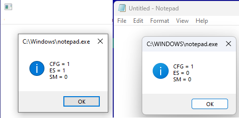

# ExportSuppression

look like (PROCESS_CREATION_MITIGATION_POLICY_CONTROL_FLOW_GUARD_EXPORT_SUPPRESSION)
not work in latest or all win 11 build, despite 
(MitigationFlagsValues.ControlFlowGuardExportSuppressionEnabled exist in EPROCESS

code work as excepted on some win10 builds ( not check latest) but not work on win11

 
